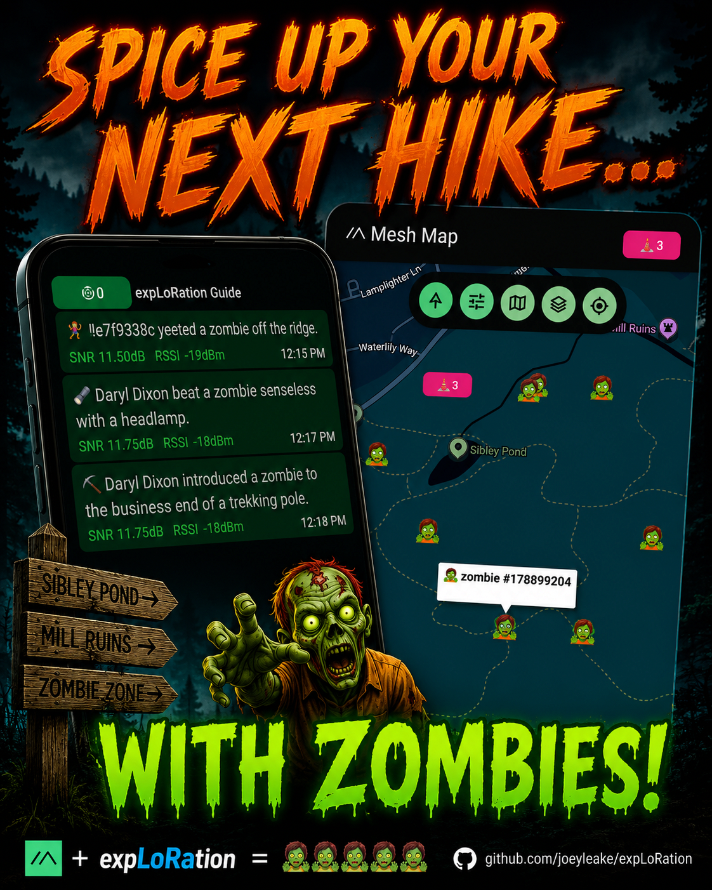

<p align="center">
  
</p>

# expLoRation

expLoRation is a YAML-defined event engine for Meshtastic mesh networks. It listens to GPS positions
and text messages from nodes on the mesh, evaluates configurable trigger conditions, and executes
responses — sending DMs, stamping waypoints, tracking scores, and more. Describe a game or scenario
in a single config file and the bot runs it, no code required.

<p align="center">
  
</p>

---

## What you can build

- **Proximity games** — geocaching hunts, warmer/colder finders, checkpoint races. Triggers fire when nodes enter zones, approach waypoints, or come within range of each other. *(see [`geocache.yaml`](examples/geocache.yaml), [`trail_race.yaml`](examples/trail_race.yaml))*
- **Interactive waypoints** — players broadcast Meshtastic waypoints that the bot adopts, renames, and tracks; combine with proximity triggers for supply-drop mechanics or visit stamps. *(see [`zombie_minigame.yaml`](examples/zombie_minigame.yaml))*
- **Passive telemetry** — track every node's movement automatically: distance traveled, move counts, rolling 24-hour windows, leaderboard on demand. *(see [`movement_tracker.yaml`](examples/movement_tracker.yaml))*
- **Guided experiences** — linear or branching narrative delivered as nodes move through physical space: ghost tours, orienteering courses, escape-room-style hunts. *(see [`ghost_walk.yaml`](examples/ghost_walk.yaml))*

---

## How it works

A config file defines **triggers** (what causes an event to fire — entering a zone, sending a DM,
receiving a GPS fix, a timer expiring) and **responses** (what happens — a message, a flag, a
waypoint, a variable update, a leaderboard). Responses target specific nodes, groups, channels,
or everyone with a given flag. Exceptions can gate any event on node state, distance, or
randomness.

```
YAML config → triggers → [exceptions] → responses → targets
```

---

## Requirements

- Python 3.10 or newer
- A Meshtastic device reachable via USB serial or TCP
- Meshtastic firmware 2.x on the device

Python dependencies (installed automatically with pip):

```
meshtastic>=2.7.0
PyYAML>=6.0
pypubsub>=4.0
```

---

## Installation

```bash
git clone https://github.com/joeyleake/expLoRation.git
cd expLoRation
pip install -r requirements.txt
```

Connect your Meshtastic device via USB, or have it reachable over TCP, before running.

---

## Quick start

Run the bot against a config file:

```bash
python bot.py --config game.yaml
```

**USB serial** — specify the port explicitly or let the bot auto-detect:

```bash
python bot.py --config game.yaml --port /dev/ttyUSB0
```

**TCP** — connect to a device running the Meshtastic TCP server (default port 4403):

```bash
python bot.py --config game.yaml --host 192.168.1.50
python bot.py --config game.yaml --host 192.168.1.50 --tcp-port 4403
```

A status summary prints every 5 minutes by default (`--status-interval` to change, `0` to
disable). Add `--verbose` to print every incoming position update.

### Minimal example config

Save this as `quickstart.yaml`, update the coordinates and node ID, and run it to see both core
trigger types working:

```yaml
channels:
  - label: main
    name: LongFast
    psk: AQ==
    monitor: true
    participate: true

zones:
  - label: start_zone
    # Replace with a small triangle around your test area
    points:
      - [37.7749, -122.4194]
      - [37.7763, -122.4181]
      - [37.7751, -122.4168]

messages:
  - label: welcome_msg
    text: "Welcome! You've entered the zone. Send '!hint' for your first clue."

  - label: hint_request
    text: "!hint"

  - label: clue_msg
    text: "Clue: head toward the big oak tree."

flags:
  - label: greeted

events:
  # Fires when a node enters the zone for the first time
  - label: greet_on_enter
    trigger:
      type: enters_zone
      target: start_zone
    responses:
      - type: send_message
        message_label: welcome_msg
        to_triggering_node: true
      - type: add_flag
        flag_label: greeted
        to_triggering_node: true
    exceptions:
      - kind: node_has_flag
        flag: greeted

  # Fires when a node in the zone sends "!hint" as a DM
  - label: hint_command
    trigger:
      type: dm
      message_label: hint_request
      zone_label: start_zone
    responses:
      - type: send_message
        message_label: clue_msg
        to_triggering_node: true
```

```bash
python bot.py --config quickstart.yaml --verbose
```

---

## Examples

The [examples/](examples/) directory contains ready-to-adapt scenarios:

| File | Scenario |
|---|---|
| [`geocache.yaml`](examples/geocache.yaml) | Classic geocaching hunt — players enter a start zone, request clues via DM, and race to find a hidden cache |
| [`ghost_walk.yaml`](examples/ghost_walk.yaml) | Self-guided ghost tour — visitors receive atmospheric story fragments as they approach points of interest; collecting all five unlocks a final revelation |
| [`trail_race.yaml`](examples/trail_race.yaml) | Trail race director — automatic checkpoint splits, finish-line announcements, cutoff warnings, and sweep alerts |
| [`castle_defense.yaml`](examples/castle_defense.yaml) | Zone-based security monitoring — three escalating alert tiers fire as unknown nodes approach a defended position |
| [`augusta_national_rangefinder.yaml`](examples/augusta_national_rangefinder.yaml) | Golf rangefinder — players DM the hole number and receive their live distance to that green |
| [`butterfly_hunt.yaml`](examples/butterfly_hunt.yaml) | Randomized scavenger hunt — butterflies spawn at random campus locations every hour; walk within 10 m of one to catch it |
| [`debug_monitor.yaml`](examples/debug_monitor.yaml) | Monitoring tool — reports live distance to waypoints on each position update; responds to `!update` and `!status` commands |
| [`movement_tracker.yaml`](examples/movement_tracker.yaml) | Passive odometer — tracks distance traveled and move count for every visible node; DM `leaderboard` for top-5 |
| [`orbital_cannon_survival.yaml`](examples/orbital_cannon_survival.yaml) | Survival game — a random node is targeted by an orbital strike; nearby nodes have seconds to flee before the blast destroys them |
| [`warmer_colder_geocache.yaml`](examples/warmer_colder_geocache.yaml) | Hot/cold hunt — nodes receive distance-band hints as they walk toward a hidden cache |
| [`zombie_minigame.yaml`](examples/zombie_minigame.yaml) | Zombie horde — players DM `spawn` to summon zombies within 200 m, kill them by walking within 20 m, throw grenades, and compete on a leaderboard |

All example files use placeholder coordinates and fictional node IDs. Replace them with your
actual values before running.

---

## Configuration

All game logic is defined in a single YAML file. See [CONFIG.md](CONFIG.md) for the complete
reference covering all trigger types, response types, targets, exceptions, variables, and
validation rules.

---

## Contributing

expLoRation is an early public release and feedback is very welcome. If you run it in the field,
find a bug, have a feature idea, or want to share a config you built, please open an issue or
pull request on GitHub. The goal is to make this useful for the broader Meshtastic community,
so real-world use reports are especially valuable.

---

## License

MIT — see [LICENSE](LICENSE).
